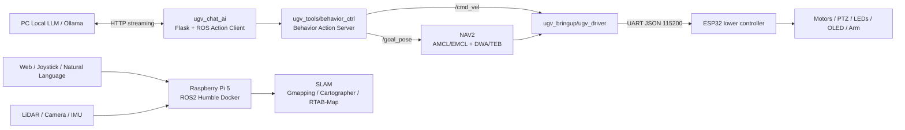
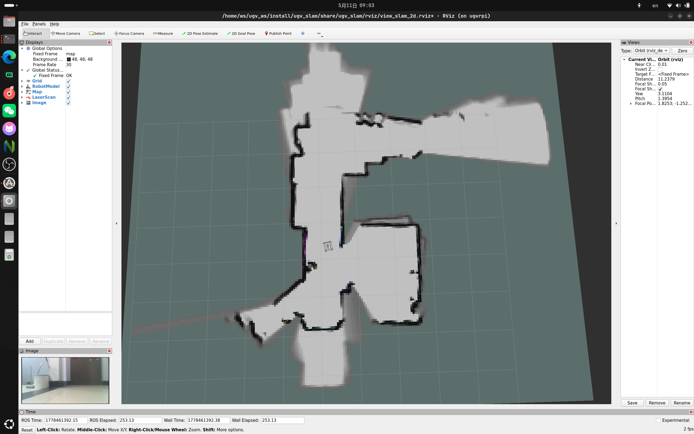
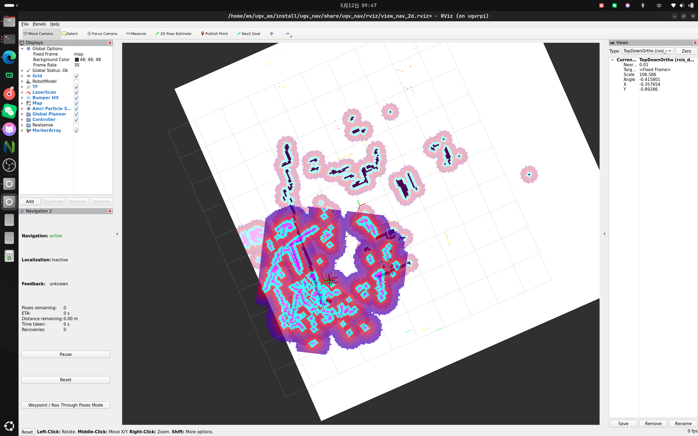
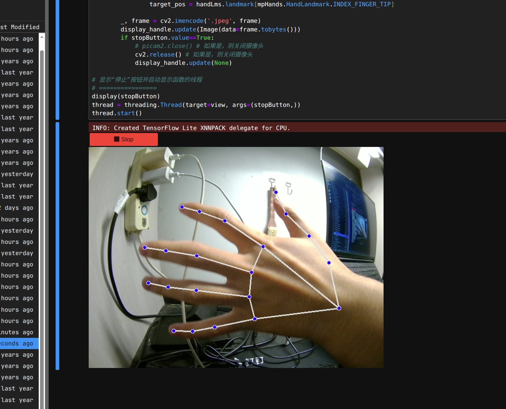

# WaveRover ROS2 UGV Project

面向机器人/嵌入式/ROS2 实习岗位的项目展示 README。项目基于 Waveshare UGV Rover 平台，在官方开源代码和教程基础上完成 ROS2 Humble 系统集成、SLAM 建图、自主导航、视觉识别和 LLM 自然语言控制链路验证。

> 项目性质说明：本仓库不是从零实现完整机器人系统，而是以 Waveshare UGV 官方工程为基础的二次集成、调试验证和能力扩展记录。README 重点展示我在真实硬件、ROS2 工程链路和问题排查中的实践能力。

## 项目概览

| 项目 | 内容 |
| --- | --- |
| 机器人平台 | Waveshare UGV Rover，ESP32 + Raspberry Pi 5 双控制器，6 轮 4WD，LiDAR，摄像头，RoArm-M2 机械臂 |
| 主要方向 | ROS2 系统集成、SLAM/NAV2、自主探索、视觉识别、LLM 指令控制 |
| 运行环境 | Raspberry Pi OS + ROS2 Humble Docker，本地 Ubuntu 24.04 + Gazebo/RViz 仿真 |
| 学习周期 | 2026.05.02 - 2026.05.27 |
| 角色定位 | ROS2 机器人系统集成与自主导航开发负责人 |

## 我完成了什么

- 打通官方 Raspberry Pi / Jupyter / Flask demo，验证轮子驱动、OLED、云台、LED、视频流和 Web 控件回传。
- 接入 ROS2 Humble 工作空间，在 Docker 环境中启动底盘、LiDAR、RViz、Gazebo 和多个功能包。
- 验证 2D SLAM：Gmapping、Cartographer；验证 3D SLAM：RTAB-Map RGB-D 建图。
- 基于二维栅格地图完成 NAV2 自主导航，比较 AMCL/EMCL 定位与 DWA/TEB 局部规划。
- 跑通自主探索流程：`slam_nav` + `explore_lite`，在封闭环境内生成地图。
- 验证 OpenCV / MediaPipe 视觉能力：运动检测、人脸识别、手势识别、姿态识别、颜色追踪、寻线自动驾驶。
- 搭建电脑端 LLM 控制链路：自然语言 -> LLM 生成 JSON -> ROS Action -> `/cmd_vel` 或 `/goal_pose` -> ESP32 串口 JSON -> 底盘执行。
- 排查并记录串口路径、终端 I/O 缓冲、键盘控制延迟、Python 多环境冲突和 Docker/ROS2 依赖问题。

## 系统架构



关键代码链路：

- `src_ws/src/ugv_main/ugv_bringup/ugv_bringup/ugv_driver.py`：订阅 `/cmd_vel`、`/ugv/joint_states`、`/ugv/led_ctrl`，转换为串口 JSON 下发到底层 ESP32。
- `src_ws/src/ugv_main/ugv_tools/ugv_tools/behavior_ctrl.py`：提供 `Behavior` Action Server，将结构化命令转为前进、后退、旋转、停止、保存点位和发布导航目标。
- `src_ws/src/ugv_main/ugv_chat_ai/ugv_chat_ai/app.py`：Flask 页面接收自然语言请求，调用本地 LLM 接口，解析 JSON 指令并发送到 ROS Action。

## 技术栈

| 模块 | 技术 |
| --- | --- |
| ROS2 | Humble、colcon、rclpy、rclcpp、Topic、Action、TF、RViz |
| 导航建图 | NAV2、Gmapping、Cartographer、RTAB-Map、AMCL、EMCL、DWA、TEB、explore_lite |
| 硬件通信 | ESP32、UART、JSON 指令、LiDAR、IMU、云台、LED、OLED |
| 视觉感知 | OpenCV、MediaPipe、AprilTag、HSV 颜色空间、形态学滤波 |
| Web/AI | Flask、JupyterLab、HTTP streaming、Ollama/local LLM、JSON 行为指令 |
| 工程环境 | Docker、Raspberry Pi OS、Ubuntu 24.04、Gazebo 11 |

## 成果展示

| 2D SLAM 建图 | 自主探索建图 |
| --- | --- |
|  |  |

| MediaPipe 手势识别 | LLM 自然语言控制 |
| --- | --- |
|  | [演示视频：自然语言转 JSON 指令](media/llm-natural-language-json.mp4) |

## 快速运行

ROS2 工作空间位于 `src_ws/`，车端 ROS 包通常在 Docker 容器内执行。

```bash
cd /home/ws/ugv_ws
./build_first.sh
source install/setup.bash
```

日常增量编译：

```bash
cd /home/ws/ugv_ws
./build_common.sh
```

启动底盘、LiDAR 和 RViz：

```bash
export UGV_MODEL=ugv_rover
ros2 launch ugv_bringup bringup_lidar.launch.py use_rviz:=true
```

2D 建图：

```bash
ros2 launch ugv_slam gmapping.launch.py use_rviz:=true
# 或
ros2 launch ugv_slam cartographer.launch.py use_rviz:=true
```

保存二维地图：

```bash
./save_2d_gmapping_map.sh
# 或
./save_2d_cartographer_map.sh
```

基于已有地图导航：

```bash
ros2 launch ugv_nav nav.launch.py use_localization:=amcl use_localplan:=teb use_rviz:=true
```

建图与导航同时启动，并配合自主探索：

```bash
ros2 launch ugv_nav slam_nav.launch.py use_rviz:=true
ros2 launch explore_lite explore.launch.py
```

LLM 控制链路：

```bash
ros2 launch ugv_bringup bringup_lidar.launch.py use_rviz:=true
ros2 run ugv_tools behavior_ctrl
ros2 run ugv_chat_ai app
```

## 工程问题与解决记录

| 问题 | 现象 | 处理/结论 |
| --- | --- | --- |
| 串口路径不一致 | Python demo 无法向 ESP32 下发指令 | 使用 `by-path` 检查设备映射，修正串口路径 |
| 终端 I/O 缓冲 | 程序退出时最后一条或多条串口指令丢失 | 认识到内核缓冲区未及时刷到硬件，后续控制逻辑避免进程立即退出 |
| 键盘控制松键延迟 | 松键后小车约 0.5s 才停止，缩短阈值又导致长按抽搐 | 根因是 Linux 终端按键重复机制，最终改用手柄事件输入 |
| Python 多环境冲突 | OpenCV/MediaPipe/云台控制行为异常 | 排查系统 Python、venv、Conda 的依赖搜索顺序，清理冲突包 |
| 3D 建图资源压力 | RTAB-Map RGB-D 建图效果可用但易崩溃 | 用 2D LiDAR 栅格图作为稳定导航主方案，3D 作为能力验证 |

## 目录结构

```text
.
├── README.md                        # GitHub 项目入口
├── docs/                            # 精简项目材料
├── media/                           # README 展示素材
├── src_base/                        # ESP32 下位机控制代码
├── src_rpi/                         # Raspberry Pi Python/Flask/Web runtime code
└── src_ws/                          # ROS2 Humble 工作空间
```

`src_ws/src/ugv_main/` 中的核心包：

- `ugv_bringup`：底盘、LiDAR、RF2O 里程计、驱动节点启动。
- `ugv_base_node`：底盘运动学与里程计相关节点。
- `ugv_slam`：Gmapping、Cartographer、RTAB-Map 建图入口。
- `ugv_nav`：NAV2 导航、定位、局部规划和点位导航。
- `ugv_tools`：键盘/手柄控制、行为 Action 控制器。
- `ugv_vision`：AprilTag、颜色追踪、手势控制等视觉交互。
- `ugv_chat_ai`：Web AI 交互与自然语言控制入口。
- `ugv_gazebo`：Gazebo 模型、世界、仿真建图和导航配置。


## 后续优化

- 为 LLM 指令执行层加入 JSON Schema 校验、动作白名单和危险动作限幅。
- 将 `behavior_ctrl` 中的动态执行逻辑改为显式函数分发表，提升安全性和可维护性。
- 补充 rosbag 数据、地图文件和实验记录，形成可复现实验报告。
- 增加单元测试/仿真测试，覆盖行为指令解析、导航点保存和异常输入处理。
- 整理 Dockerfile 与一键启动脚本，降低他人在新机器上复现的成本。
