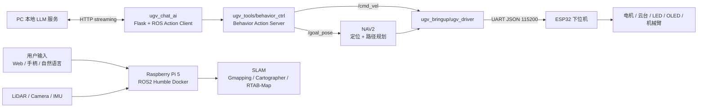

# WaveRover ROS2 UGV 小车项目开发报告

## 1. 项目背景

本项目基于 Waveshare UGV Rover 六轮四驱机器人平台开展，目标不是从零自研整套机器人硬件和底层驱动，而是在官方开源工程的基础上完成真实硬件环境下的系统集成、功能验证、问题排查和能力扩展。项目面向机器人、嵌入式、ROS2 和具身智能方向的实习展示，重点体现对实际机器人系统链路的理解与调试能力。

项目从官方 Python/Jupyter/Flask demo 跑通开始，逐步进入 ROS2 Humble 工作空间，在 Docker 环境中接入底盘、LiDAR、摄像头、RViz、Gazebo、SLAM、NAV2、视觉识别和 LLM 自然语言控制。最终完成了“感知 - 建图 - 定位 - 导航 - 行为控制 - 底盘执行”的基础闭环，并验证了自然语言到结构化机器人控制指令的实验链路。

## 2. 项目目标

项目开发过程中将目标拆成四个阶段：

| 阶段 | 目标 | 验证结果 |
| --- | --- | --- |
| 官方 demo 打通 | 验证底盘、OLED、云台、LED、串口 JSON、Web 控制和摄像头链路 | 完成 |
| ROS2 接入 | 在 ROS2 Humble Docker 中启动底盘驱动、LiDAR、RViz、模型和控制节点 | 完成 |
| SLAM 与导航 | 验证 Gmapping、Cartographer、RTAB-Map，并基于 2D 地图完成 NAV2 导航 | 完成 |
| AI/视觉扩展 | 验证 OpenCV/MediaPipe 视觉识别，搭建 LLM 到 ROS Action 的控制链路 | 完成 |

## 3. 硬件与软件环境

### 3.1 硬件平台

机器人采用上下位机协作结构：

| 层级 | 设备 | 职责 |
| --- | --- | --- |
| 上位机 | Raspberry Pi 5 | ROS2、Web 应用、JupyterLab、视觉处理、策略与行为控制 |
| 下位机 | ESP32 | 电机控制、IMU、OLED、LED、舵机、机械臂、串口 JSON 通信 |
| 传感器 | LiDAR、摄像头、IMU | 建图、定位、视觉识别和姿态反馈 |
| 执行机构 | 六轮底盘、云台、LED、机械臂 | 运动执行和外设控制 |

平台特点是上位机适合做较复杂的软件逻辑，下位机负责实时性更强的运动控制和外设控制。二者通过 UART 以 JSON 指令通信。

### 3.2 软件环境

| 类别 | 使用内容 |
| --- | --- |
| 操作系统 | Raspberry Pi OS，Ubuntu 24.04 |
| ROS 环境 | ROS2 Humble，Docker 容器 |
| ROS 工具 | colcon、RViz、Gazebo、TF、Topic、Action |
| 建图导航 | Gmapping、Cartographer、RTAB-Map、NAV2、AMCL、EMCL、DWA、TEB、explore_lite |
| 视觉 | OpenCV、MediaPipe、AprilTag、HSV 颜色筛选、形态学滤波 |
| Web/AI | Flask、JupyterLab、本地 LLM/Ollama 接口、HTTP streaming、JSON 指令 |

## 4. 系统总体架构



核心控制链路可以概括为：

1. 用户通过 Web、手柄、RViz 或自然语言产生控制意图。
2. ROS2 层将控制意图转换为 Topic、Action 或导航目标。
3. `ugv_driver` 将 ROS2 消息转换为 ESP32 可识别的 JSON 串口命令。
4. ESP32 执行电机、舵机、LED、OLED 等底层控制。

## 5. 开发过程

### 5.0 实际开发时间线

项目推进不是一次性完成，而是按“先底层、再 ROS、再导航、最后智能扩展”的顺序迭代。实际过程如下：

| 时间 | 工作重点 | 主要产出 |
| --- | --- | --- |
| 2026.05.02 | 环境准备、仓库整理、系统连接 | 完成开发目录搭建，确认树莓派网络访问方式 |
| 2026.05.03 | Python 基础控制 demo | 跑通轮子驱动，发现串口指令末尾丢失问题 |
| 2026.05.04 | JupyterLab 与串口通信 | 跑通 OLED、UI 控件和串口路径配置 |
| 2026.05.05 | Flask、摄像头和视觉 demo | 完成视频流、运动检测、人脸识别、颜色追踪、手势识别、寻线等验证 |
| 2026.05.06 | Web 数据回传和自启动 | 验证 Web 控件回传，理解 systemctl 与 crontab 自启动方案 |
| 2026.05.07 | 正式进入 ROS2 | 在 Docker 中启动 ROS2 节点、RViz、底盘、传感器和控制节点 |
| 2026.05.11 | 控制方式调试 | 分析键盘控制松键延迟，最终转向手柄事件输入 |
| 2026.05.12 | SLAM、NAV2、LLM 控制 | 跑通 Gmapping、Cartographer、导航、自主探索和自然语言转 JSON 控制 |
| 2026.05.14 - 05.15 | Conda/ROS 环境整理 | 排查 Python 多环境冲突，尝试本地 Ubuntu/ROS 环境 |
| 2026.05.16 - 05.17 | AI 与 Python 基础补强 | 补充神经网络、计算机视觉和 Python 基础 |
| 2026.05.22 - 05.27 | ROS 知识整合与项目复盘 | 完成 ROS 学习补强，整理项目经历和后续优化方向 |

### 5.1 阶段一：官方 demo 跑通与底层能力确认

项目早期没有直接进入 ROS2，而是先验证硬件是否可控。这样做的原因是机器人系统调试中，软件层级较多，如果直接从 ROS2 排查问题，很难判断故障来自硬件、串口、Python 环境、ROS 节点还是传感器。

这一阶段主要完成：

- 配置小车 AP/STA 网络连接，确认电脑能够通过 SSH、Web 和 JupyterLab 访问树莓派。
- 基于官方 Python demo 验证轮子驱动、云台控制、OLED 显示、LED 控制、摄像头视频流。
- 使用 JSON 指令测试上位机到下位机的通信。
- 运行 Flask Web demo，确认浏览器端能够接收视频流并回传控制数据。
- 运行 JupyterLab demo，验证交互式教程、摄像头画面显示和基础视觉处理。

这一阶段的主要价值是确定硬件链路可用，并熟悉 Waveshare 官方工程的目录结构和控制协议。

### 5.2 阶段二：ROS2 Humble 工作空间接入

在底层 demo 可用后，项目进入 ROS2 阶段。官方 ROS2 工程位于 `src_ws/`，核心包在 `src_ws/src/ugv_main/`，第三方依赖包在 `src_ws/src/ugv_else/`。

构建方式采用分包编译：

```bash
cd /home/ws/ugv_ws
./build_first.sh
source install/setup.bash
```

日常开发时使用：

```bash
cd /home/ws/ugv_ws
./build_common.sh
```

底盘、LiDAR、模型和 RViz 的启动入口为：

```bash
export UGV_MODEL=ugv_rover
ros2 launch ugv_bringup bringup_lidar.launch.py use_rviz:=true
```

该 launch 文件会启动机器人模型、底盘 bringup、串口驱动、LiDAR、RF2O 激光里程计和底盘运动学节点。接入成功后，可以在 RViz 中观察模型、LaserScan、TF、odom 等基础数据。

### 5.3 阶段三：底盘控制链路验证

底盘控制的关键文件是：

- `src_ws/src/ugv_main/ugv_bringup/ugv_bringup/ugv_driver.py`
- `src_ws/src/ugv_main/ugv_base_node/src/base_node.cpp`
- `src_ws/src/ugv_main/ugv_tools/ugv_tools/keyboard_ctrl.py`
- `src_ws/src/ugv_main/ugv_tools/launch/teleop_twist_joy.launch.py`

其中 `ugv_driver.py` 订阅 ROS2 的 `/cmd_vel`，并将速度命令转换为 ESP32 下位机使用的 JSON 格式：

```json
{"T": "13", "X": linear_velocity, "Z": angular_velocity}
```

同一节点还订阅 `/ugv/joint_states` 和 `/ugv/led_ctrl`，分别将云台角度和 LED 控制量转换为下位机指令。这说明 ROS2 层并不直接控制电机和外设，而是通过统一的 JSON 协议把控制请求交给 ESP32。

控制方式先后验证了键盘和手柄。键盘控制在测试中暴露出松键延迟问题：按住前进时小车运动正常，但松键后存在约 0.5 秒延迟。进一步分析发现，问题并不在底盘驱动，而在 Linux 终端字符流机制。终端键盘输入只有按键字符，没有可靠的“按下/释放”事件，长按时还会存在初始重复延迟，因此无法同时满足“长按平滑”和“松键立即停止”。最终控制方式转向手柄输入，使用事件驱动方式区分按下和释放。

### 5.4 阶段四：2D/3D SLAM 建图验证

建图阶段主要验证三套方案：

| 方案 | 输入 | 验证结论 |
| --- | --- | --- |
| Gmapping | 2D LiDAR + odom | 资源占用较低，适合基础二维栅格建图 |
| Cartographer | 2D LiDAR + odom | 地图效果较好，也支持后续 pure localization |
| RTAB-Map | 深度相机 + LiDAR | 能验证 3D 建图，但对树莓派资源压力较大 |

Gmapping 启动命令：

```bash
ros2 launch ugv_slam gmapping.launch.py use_rviz:=true
```

Cartographer 启动命令：

```bash
ros2 launch ugv_slam cartographer.launch.py use_rviz:=true
```

保存二维地图：

```bash
./save_2d_gmapping_map.sh
# 或
./save_2d_cartographer_map.sh
```

实际开发中，2D 建图是最稳定的主线方案。RTAB-Map 三维建图可以跑通，但在树莓派上资源消耗明显，长时间运行更容易出现卡顿或崩溃，因此最终把 2D LiDAR 栅格地图作为后续导航的主要输入，3D 建图作为能力验证。

### 5.5 阶段五：NAV2 自主导航

导航阶段主要验证定位算法和局部规划算法组合：

| 模块 | 可选方案 |
| --- | --- |
| 定位 | AMCL、EMCL、Cartographer pure localization |
| 局部规划 | DWA、TEB |
| 地图 | 2D occupancy grid map |

启动方式：

```bash
ros2 launch ugv_nav nav.launch.py use_localization:=amcl use_localplan:=teb use_rviz:=true
```

在 RViz 中设置初始位姿后，通过 `2D Goal Pose` 发布目标点，观察全局路径、局部路径、代价地图和底盘执行效果。实际测试中，二维导航能够完成目标点移动，但在较窄空间内会表现出停顿或绕行保守的问题。这类问题与局部规划器参数、代价地图膨胀半径、机器人 footprint、传感器噪声和环境宽度都有关系。

此外，还验证了建图与导航同时运行：

```bash
ros2 launch ugv_nav slam_nav.launch.py use_rviz:=true
ros2 launch explore_lite explore.launch.py
```

这一流程用于封闭环境下的自动探索建图。通过 RViz 可以观察地图逐步扩展、探索目标点生成和导航状态变化。

### 5.6 阶段六：视觉识别与视觉交互

视觉部分分为官方 Python demo 和 ROS2 视觉包两条线验证。

Python demo 中主要验证：

- OpenCV 运动检测。
- OpenCV/DNN 物体识别。
- OpenCV 人脸检测。
- MediaPipe 手势、人脸、姿态关键点识别。
- HSV 颜色识别与颜色追踪。
- 基于视觉的寻线自动驾驶。

ROS2 视觉包 `ugv_vision` 中保留了多个入口：

- `color_track`
- `gesture_ctrl`
- `apriltag_ctrl`
- `apriltag_track_0`
- `apriltag_track_1`
- `apriltag_track_2`

视觉验证过程中，HSV 颜色空间比 BGR 更适合做颜色范围筛选，因为 HSV 将色相、饱和度和亮度分离，能够减少光照变化对颜色判断的影响。寻线自动驾驶中使用腐蚀和膨胀做噪声处理，再通过双采样区域判断线的位置状态，最后映射为前进、左转、右转或停止等底盘动作。

### 5.7 阶段七：LLM 自然语言控制链路

LLM 控制链路是本项目后期扩展部分，目标是验证“自然语言 -> 结构化指令 -> ROS 行为执行”的闭环。

相关文件：

- `src_ws/src/ugv_main/ugv_chat_ai/ugv_chat_ai/app.py`
- `src_ws/src/ugv_main/ugv_chat_ai/ugv_chat_ai/templates/index.html`
- `src_ws/src/ugv_main/ugv_tools/ugv_tools/behavior_ctrl.py`
- `src_ws/src/ugv_main/ugv_interface/action/Behavior.action`

运行流程：

```bash
ros2 launch ugv_bringup bringup_lidar.launch.py use_rviz:=true
ros2 run ugv_tools behavior_ctrl
ros2 run ugv_chat_ai app
```

实现逻辑为：

1. Flask Web 页面接收用户自然语言输入。
2. `ugv_chat_ai` 通过 HTTP 请求本地 LLM 服务。
3. LLM 以流式方式返回文本和 JSON 指令。
4. 程序用正则提取 `json` 代码块，并封装为 JSON 列表。
5. `ChatAi` 节点作为 ROS Action Client，将指令发送到 `/behavior`。
6. `behavior_ctrl` 解析行为指令，并发布 `/cmd_vel` 或 `/goal_pose`。

当前已验证的行为包括：

| 行为 | 说明 |
| --- | --- |
| `drive_on_heading` | 按里程计估算前进指定距离 |
| `back_up` | 后退指定距离 |
| `spin` | 原地旋转指定角度 |
| `stop` | 停止底盘 |
| `save_map_point` | 保存当前位置为命名导航点 |
| `pub_nav_point` | 发布已保存点位到 `/goal_pose` |

该链路已经能展示自然语言控制机器人雏形，但也暴露出安全问题：`behavior_ctrl` 中当前使用动态字符串执行行为，后续应改为显式函数分发表，并加入 JSON Schema、动作白名单、速度/距离/角度限幅和异常输入处理。

## 6. 关键问题排查

### 6.1 串口路径问题

早期 Python demo 无法稳定向 ESP32 发送指令。排查时发现问题与串口设备路径有关，不同设备环境下串口名可能不同。通过检查硬件接口映射，修正串口路径后恢复通信。这个问题也说明机器人系统调试必须先确认设备节点、权限和硬件连接，再向上排查应用层。

### 6.2 串口指令丢失

在部分 demo 中出现最后一条或多条指令没有发送到底层的现象。现象表现为程序执行结束较快，而下位机没有收到预期的最后动作。分析后认为原因与进程退出时内核缓冲区尚未完全刷到串口硬件有关。后续在控制逻辑上避免发完指令立即退出，并更加关注串口写入后的刷新和进程生命周期。

### 6.3 键盘控制延迟

键盘控制中出现松键后约 0.5 秒才停止的问题。尝试缩短超时阈值后，单次按键更灵敏，但长按会出现运动抖动。最终定位到 Linux 终端字符输入机制：终端只能读取字符流，不能直接获得可靠的按下/释放事件；长按第一个字符后还存在系统级按键重复延迟。因此键盘控制天然不适合做高可靠的实时运动控制，最终转向手柄事件输入。

### 6.4 Python 多环境冲突

视觉 demo 调试中出现依赖加载异常，涉及系统 Python、venv 和 Conda 多环境共存。问题表现为程序调用到了旧版本或错误位置的依赖，导致摄像头、OpenCV 或云台控制行为异常。处理方法是明确 Python 环境来源，检查包搜索路径，清理冲突依赖，避免系统环境与虚拟环境混用。

### 6.5 3D 建图资源瓶颈

RTAB-Map RGB-D 建图在功能上可以跑通，但树莓派上计算资源有限，运行过程中容易卡顿。最终项目选择 2D LiDAR 建图作为稳定导航主线，3D 建图只作为扩展能力验证。

## 7. 测试与验证结果

| 测试项 | 方法 | 结果 |
| --- | --- | --- |
| 底盘运动 | Python demo、`/cmd_vel`、键盘/手柄控制 | 可控制前进、后退、转向、停止 |
| 外设控制 | JSON 指令、ROS joint state、LED topic | OLED、LED、云台链路可用 |
| 视频链路 | Flask/Jupyter 摄像头画面 | 可显示实时画面 |
| 2D 建图 | Gmapping、Cartographer、RViz | 可生成二维栅格地图 |
| 自主导航 | NAV2 + AMCL/EMCL + DWA/TEB | 可基于地图执行目标点导航 |
| 自主探索 | `slam_nav` + `explore_lite` | 可在封闭区域进行探索建图 |
| 视觉识别 | OpenCV、MediaPipe | 可识别人脸、手势、姿态、颜色和运动 |
| LLM 控制 | Flask + 本地 LLM + ROS Action | 可将自然语言转为 JSON 行为指令并下发 |

## 8. 项目成果

项目最终形成了三个层面的成果：

1. **工程可运行成果**：整理出 `src_ws`、`src_rpi`、`src_base` 三部分工程，分别覆盖 ROS2、树莓派上位机和 ESP32 下位机。
2. **功能验证成果**：完成 SLAM 建图、自主导航、自动探索、视觉识别和 LLM 控制演示。
3. **问题复盘成果**：记录串口、键盘控制、Python 环境、Docker/ROS2 依赖和资源瓶颈等实际工程问题。

## 9. 不足与后续优化

当前项目仍有明显可优化点：

- LLM 行为执行层需要去掉动态 `exec`，改成显式函数分发表。
- JSON 指令需要加入 Schema 校验、动作白名单和参数范围限制。
- 导航参数还需要针对真实场地调优，例如 costmap inflation、footprint、TEB/DWA 参数。
- 建图和导航结果应补充 rosbag、地图文件、实验环境说明和复现实验记录。
- Docker 镜像、依赖安装和一键启动脚本需要进一步整理，降低其他机器复现成本。
- 视觉识别目前主要是功能验证，距离稳定的闭环视觉导航还有距离。

## 10. 总结

本项目的核心价值不在于单个算法从零实现，而在于把真实机器人平台上的多个软件和硬件层级串成可运行系统。开发过程覆盖了硬件通信、Linux 设备与终端机制、Python 环境管理、ROS2 节点与 Action、SLAM/NAV2、视觉识别和 LLM 控制链路。通过这个项目，我对机器人系统开发中“先验证底层，再接入中间件，最后做智能扩展”的工程顺序有了更清晰的理解，也积累了多个真实问题的排查经验。
